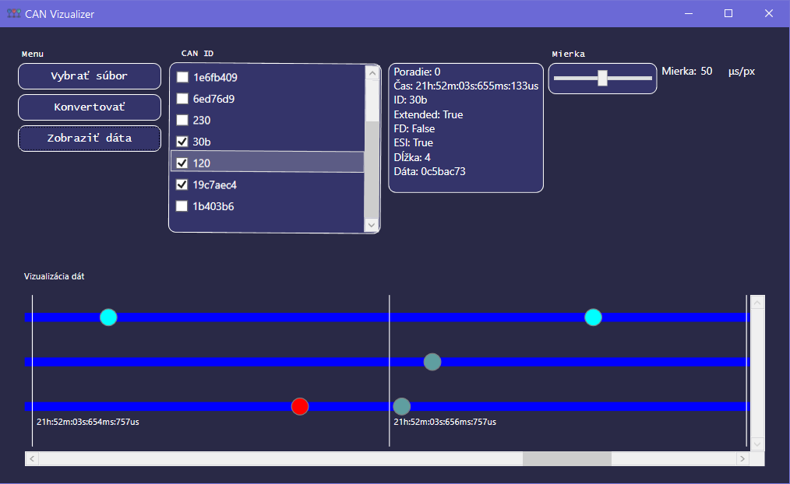

# Desktop Visualizer

### Desktop Visualizer for logged CAN data

 

Desktop Visualizer is meant to graphically display logged CAN data that are stored in .csv file and then convert CSV file to VCD.

---
Thanks to direct access to the system files, when converting to a VCD file, it is possible to process a file of bigger size, because we can directly write data to the file, it does not have to be stored in the operating memory, and thus its volume is not limited by the size of the RAM.

 

## 📝License

This repository was created for our school project in cooperation with ComAp s.r.o. 
Our technical documentation to this project can be read [HERE](https://github.com/daniel-slosar/DesktopVisualizer/tree/master/Technical%20Documentation/TechDocumentation.pdf).

## 📈Usage

Application takes CSV file with logged and formated CAN data and graphically displays data on timeline. 

 

## Python CSV Data Generator

---

Python script that generates CAN data into CSV file

- For testing we needed to generate CAN data so we could test our Desktop Visualizer
- This script generates data like:
    - Logged time
    - CAN ID
    - IDE
    - FDF
    - ESI
    - DLC
    - DATA
- Script generates n-lines of data into csv file and saves it

[Python_CSV_Generator.py](https://github.com/daniel-slosar/DesktopVisualizer/tree/master/Python%20Generator/CSV_Generator.py)

### Showcase of CSV file data

